# AeroAdmin AFM — Documentación general

> **Fecha**: 2026-08-10
> **Versión**: 1.0
> **Estado del proyecto**: master en producción (`9c72fd4`)

## ¿Qué es AeroAdmin AFM?

Plataforma de gestión para un operador de drones de fumigación en el
Valle del Cauca, Colombia. **Un solo cliente**, **~1.213 parcelas**,
**~16k vuelos** y **~17k fumigaciones** registradas.

**Funcionalidades core**:

- Inventario de parcelas con geometría PostGIS (EPSG:4326)
- Visualización en mapa (MapLibre + EOX Sentinel-2 cloudless 2020)
- Registro de fumigaciones manuales y desde scraper DJI
- Alertas de cadencia (vencidas, por vencer, al día)
- Reportes PDF + CSV por parcela individual o agregados por hacienda
- Importación GIS de fincas (SHP / KML / KMZ)

**Stack**: Next.js 16 + React 19 + TypeScript 5 + PostGIS + NextAuth v5 + Playwright.

**Single-tenant**, **single-contributor** (@agFab). El cliente (operador
cañero) consume la plataforma y descarga los reportes PDF/CSV para
presentarlos a sus clientes finales y para auditoría ICA.

---

## Interfaz — capturas de pantalla

### Dashboard (`/`)

El panel principal muestra KPIs, salud del pipeline, y actividad
reciente. Carga con Suspense boundaries.

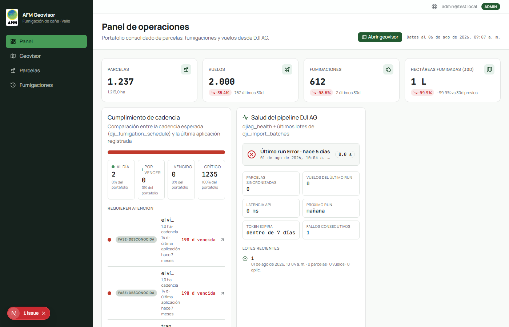

### Inventario de parcelas (`/parcelas`)

Lista de las 1.213 parcelas con filtros (estado, municipio, hacienda,
variedad). Botones "PDF" y "CSV" por parcela para reportes
individuales.

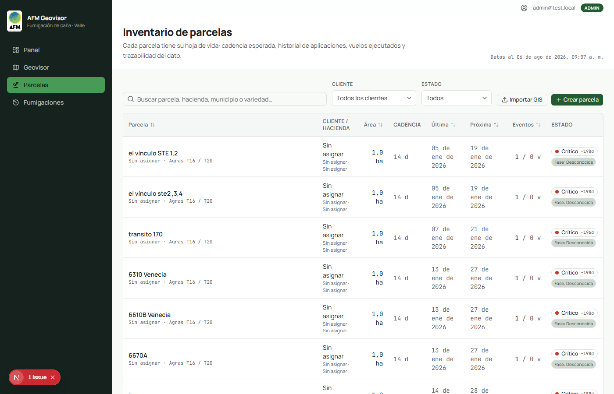

### Detail page de una parcela (`/parcelas/[id]`)

Ficha técnica completa: geometría, vuelos georreferenciados, ritmo de
aplicación, historial de trabajos, cambios de cadencia, formulario
de fumigación manual.

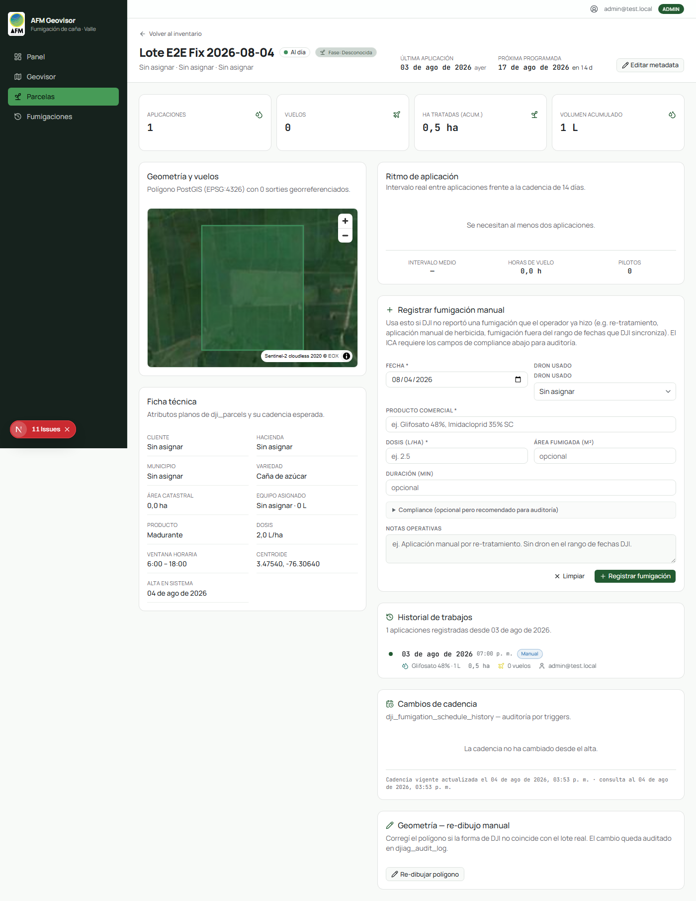

### Detail page con feature de reportes (post-sprint 2026-08-08)

Después del sprint `feature/reports-level-1`, las parcelas tienen
botones "PDF" y "CSV" en el header. El PDF incluye imagen satelital
real (EOX Sentinel-2) con el polígono de la parcela.

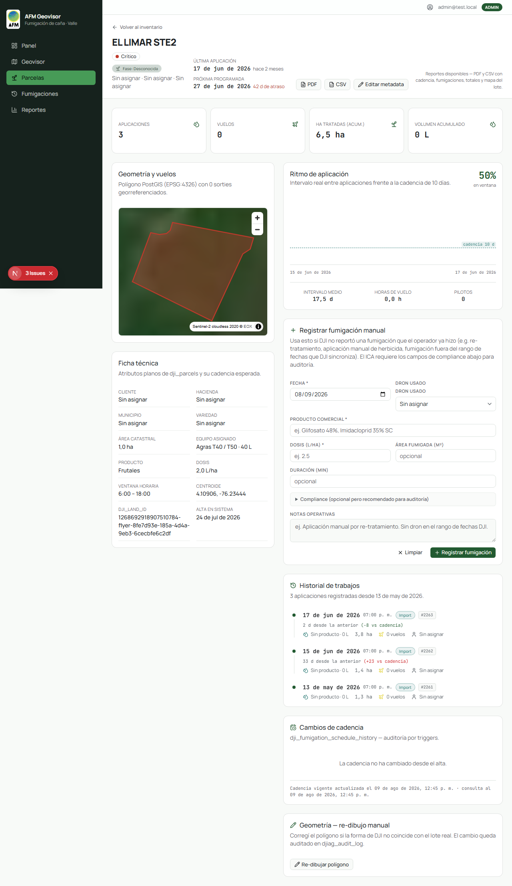

### Página de reportes (`/reportes`) — feature sprint 2026-08-08

Nueva página con filtros (rango fechas + dropdown de hacienda) y
descarga de reportes agregados. Vista default = "última fumigación
destacada + form" con tabla por parcela.

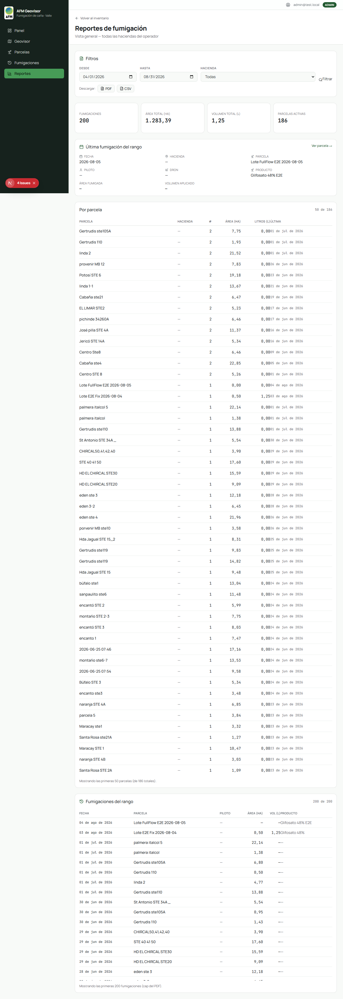

Filtrada por una hacienda específica:

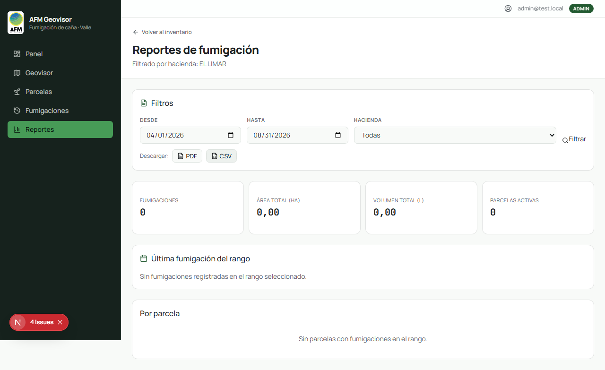

### Geovisor (`/geovisor`)

Vista de mapa con la capa de parcelas, agrupadas por hacienda, con
filtros laterales.

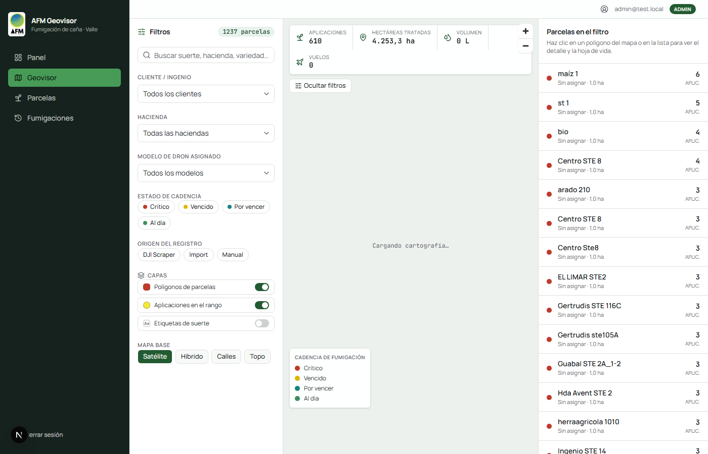

### Wizard de importación GIS

Para fincas nuevas, el operador sube un SHP / KML / KMZ y el
sistema lo previsualiza antes de commitear. Múltiples pasos: upload
→ preview → corrección de polígonos → commit.

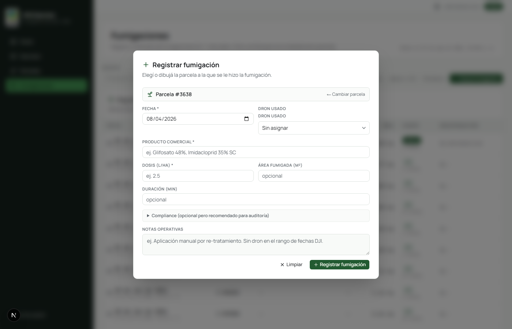
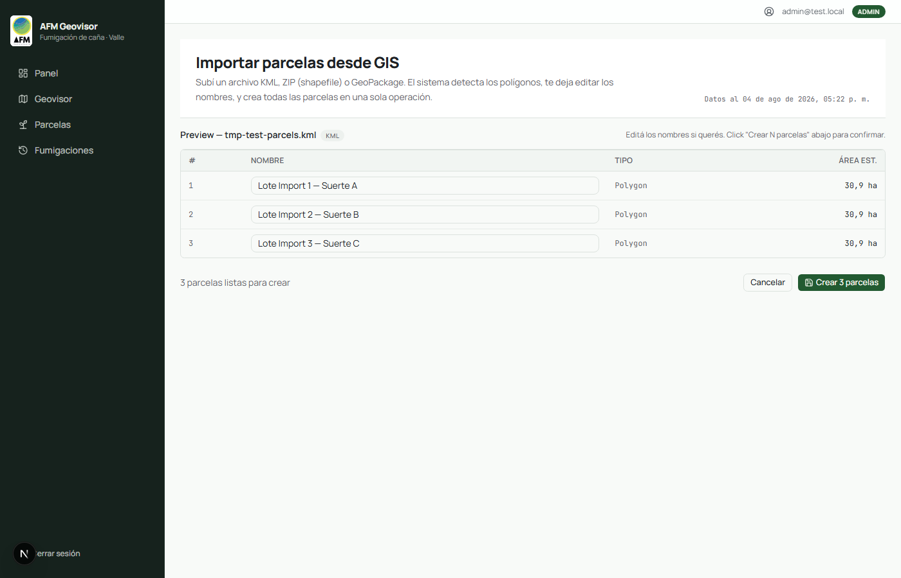
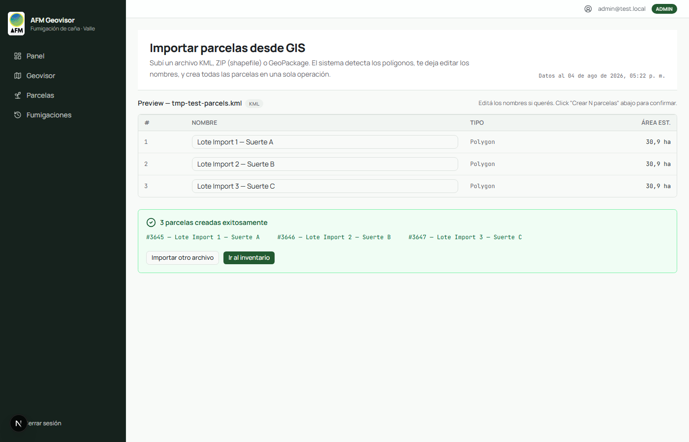

### Listado de fumigaciones (`/fumigaciones`)

Todas las fumigaciones del operador en una sola tabla, con filtros
(fecha, parcela, producto, ICA). Las fumigaciones manuales se
registran desde el form del detail page de una parcela.

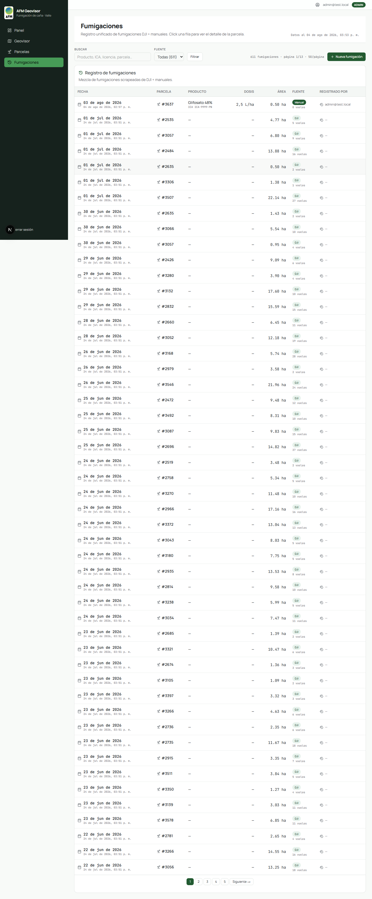

### Form de fumigación manual

Cuando el operador fumigó algo que DJI no reportó (re-tratamiento,
aplicación manual, etc.), registra la fumigación desde aquí.
**Validación estricta** de ICA license y pilot license.

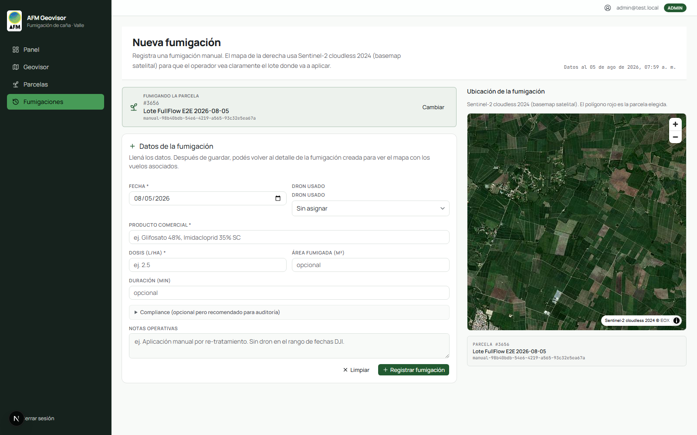

### Panel admin (`/admin/parcels`)

Edición inline de `client_name`, `farm_name`, `municipality`,
`variety` para corregir metadata de parcelas DJI mal importadas.

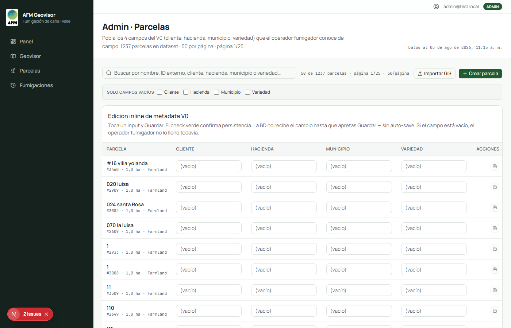

---

## Reportes PDF (feature/reports-level-1+2)

El operador fumigador descarga reportes PDF/CSV desde cualquier
parcela (botones en el header) o desde la página `/reportes` con
filtros por rango + hacienda.

### PDF por parcela individual

El PDF incluye resumen, ubicación (imagen satelital + coordenadas),
fumigaciones del último mes, y totales. La imagen satelital se
renderiza server-side con MapLibre + EOX Sentinel-2 cloudless 2020.

Ejemplo del PDF final (última versión, con imagen satelital):


### PDF por hacienda / multi-hacienda

Resumen de fumigaciones de una hacienda o de todas en el rango.
Una fila por parcela con # fumigaciones, área total, litros,
última fumigación.


Detalle del feature completo (incluye decisiones de producto y
deuda técnica) en `docs/features/reports/README.md`.

---

## Stack técnico

| Capa | Tecnología | Versión |
|---|---|---|
| Framework | Next.js | 16.2.4 |
| UI | React + Tailwind CSS 4 + @base-ui/react | 19.2.5 / 4.2.4 / 1.6 |
| Mapas | MapLibre GL JS + EOX Sentinel-2 cloudless | 4.7.1 / 2020 |
| Auth | NextAuth v5 (beta.31) + bcryptjs | — |
| DB | Postgres 16 + PostGIS 3.4 (Supabase) | — |
| ORM | `pg` driver puro + SQL hand-written | 8.20.0 |
| Reportes | Playwright + @sparticuz/chromium (PDF) + PapaParse-style helpers | — |
| Tests | Vitest 3.2.4 + @vitest/coverage-v8 + Playwright 1.61.1 | — |
| Scraper DJI | Playwright headless (Coreano via `accept-language: zh-CN,zh`) | — |
| Deploy | Vercel | — |

---

## Arquitectura

```
[ DJI SmartFarm Web ] → [ Playwright scraper ] → [ dji_flights + dji_fumigations ]
                                                    ↓
[ Operador fumigador ] → [ Form manual ] ───────→ [ dji_fumigations (source='manual') ]
                                                    ↓
                                       [ Spatial join (PostGIS) ] ←─── [ dji_parcels ]
                                                    ↓
                                [ Triggers: schedule + cadencia + alerts ]
                                                    ↓
[ API /api/* ] ←─── [ Vercel Edge/Node ] ──→ [ V0 adapter ] → [ Pages (server) ]
        ↓                                                            ↓
[ Components (UI) ]                                          [ Reportes PDF/CSV ]
```

**Capas de la app**:

- `app/` — pages (server) + route handlers (API). Auth + data fetching.
- `api/` — capa de data access (`repositories.ts` + `queries.ts`).
- `lib/` — lógica de negocio pura: cadencia, alertas, agregaciones,
  parsers, reports.
- `lib/data.ts` — V0 adapter (port del mockup V0). Mapea
  `DjiParcelRecord` a shape V0.
- `components/` — React components. Reciben data por props.
- `lib/reports/` — generación de PDF/CSV. Server-only.
- `scripts/` — CLI del pipeline DJI.
- `db/migrations/` — migrations SQL. Aplicadas con `npm run db:migrate`.

**Convenciones clave**:

- `pg` NUNCA se importa desde `app/` ni `components/`. Solo `api/` y
  `lib/db.ts`.
- Components reciben data por props. No importan `api/`.
- Auth en API: `requireRole(["admin", "supervisor"])` o `requireRole("admin")`.
- Tests con TDD: rojo → verde → refactor. Coverage global ≥ 75% lines
  / 70% branches.

Ver `docs/ARCHITECTURE.md`, `docs/TDD.md`, `docs/STACK.md` para
detalles técnicos completos.

---

## Estado actual (master, 2026-08-10)

| Métrica | Valor |
|---|---|
| Tests | 1235/1235 verde |
| Arch:check | 0 errors |
| Build | ✅ verde en CI |
| Cobertura | ~80% (umbral 75%) |
| Endpoints API | ~30 (admin + health + reports + auth) |
| Pages | 8 (`/`, `/login`, `/parcelas`, `/parcelas/[id]`, `/admin/parcels`, `/geovisor`, `/fumigaciones`, `/reportes`) |
| Migrations SQL | 32 archivos en `db/migrations/` |
| Parcelas | ~1.213 |
| Fumigaciones | ~17.000 (640 importadas DJI + 2 manuales) |
| Vuelos | ~8.759 (`dji_flights`) |
| Última fumigación registrada | 2026-08-05 |

**Sprint 2026-08-08 (feature/reports-level-1+2)** cerrado y pusheado:

- ✅ Reportes PDF + CSV por parcela individual (`/api/admin/parcels/[id]/report.{pdf,csv}`)
- ✅ Imagen satelital real (EOX + MapLibre + Playwright screenshot)
- ✅ Página `/reportes` con filtros (rango + hacienda) y reportes agregados
- ✅ Callout "Reportes disponibles" en detail page
- ✅ Sidebar: link "Reportes" nuevo
- ✅ Documentación: `docs/features/reports/README.md` + `docs/audit/DOSE_FIELDS_BACKFILL.md`

**Sprint 2026-08-10 (chore + fix)** cerrado y pusheado:

- ✅ `nativeButton={false}` en 14 Buttons con `render={<a/>}` (accessibility)
- ✅ 21 archivos `tmp-*.js/log/err` movidos a `tmp-trash/`
- ✅ `.gitignore` actualizado con 4 patrones nuevos

---

## Cómo correrlo en dev

```bash
# 1. Levantar la BD local
npm run db:up
npm run db:migrate

# 2. Instalar deps
npm install

# 3. (Opcional) Crear el admin de test
$env:AUTH_SEED_EMAIL = "admin@test.local"
$env:AUTH_SEED_PASSWORD = "TestAdmin2026!"
npm run auth:seed

# 4. Levantar el dev server
npm run dev
# → http://localhost:3000
# Login: admin@test.local / TestAdmin2026!
```

**Para producción**: deploy a Vercel con las env vars del template
(`.env.local` documentado en `AGENTS.md`).

**Para correr el pipeline DJI**:

```bash
npm run pipeline:djiag           # pipeline completo
npm run scrape:djiag:smoke       # smoke test (1 día)
npm run health:watchdog          # watchdog manual
```

---

## Roadmap

### ✅ Hecho (último sprint)

- Reportes PDF + CSV con imagen satelital
- Página `/reportes` con filtros

### 🟡 Próximos (backlog inmediato)

1. **`/parcels/overdue` page** — lista de parcelas vencidas, top-of-mind para el fumigador al iniciar el día
2. **"Mark as fumigated" button** en el dashboard, para registrar fumigación rápida sobre parcela vencida
3. **`/admin/djiag-health` UI** — el operador ve si el scraper DJI está caído
4. **Geometry audit UI** — 1.213 parcelas con `spray_geom` NULL tras import incompleto
5. **User management UI** — alta/baja de usuarios desde la app (hoy solo CLI)
6. **Password reset** — flujo "olvidé mi contraseña"

### 🟢 A largo plazo (sprints siguientes)

7. **Tabla `products`** con catálogo curado (Roundup, Glifosato, etc.) + FK en `dji_fumigations`. Resuelve la deuda de `product_used` y `dose_l_per_ha` (ver `docs/audit/DOSE_FIELDS_BACKFILL.md`).
8. **Detalle de vuelos** — el endpoint DJI `/flight_records/{id}` (detail) podría traer el producto y dosis que el list no expone. Requiere captura con auth real.
9. **Watchdog de health** arreglado — necesita `HEALTH_TOKEN` secret en Vercel deploy.

### 🔵 Refinamiento (cuando haya data real)

10. Cultivos reales por parcela (no solo "Farmland") — espera confirmación del cliente
11. Cadencias operativas reales por parcela
12. Productos comerciales usados por parcela

---

## Deuda técnica documentada

- **`docs/audit/DOSE_FIELDS_BACKFILL.md`** — `product_used` y
  `dose_l_per_ha` no se capturan del scraper DJI (limitación del
  backend externo). El form manual SÍ los captura. Las 640
  fumigaciones del dataset histórico DJI siguen con esos campos
  NULL. La solución definitiva es una tabla `products` curada (sprint
  aparte).
- **`docs/SPEC.md`** + **`docs/FUMIGATION_CADENCE.md`** — defaults
  conservadores hasta que el cliente confirme cadencias reales.

---

## Contacto

- **Repo**: `https://github.com/Nes-Curly13/aeroadmin-afm.git`
- **Operador fumigador**: cliente del Valle del Cauca, Colombia
- **Dev**: @agFab (single-contributor)
- **Última actualización**: 2026-08-10
